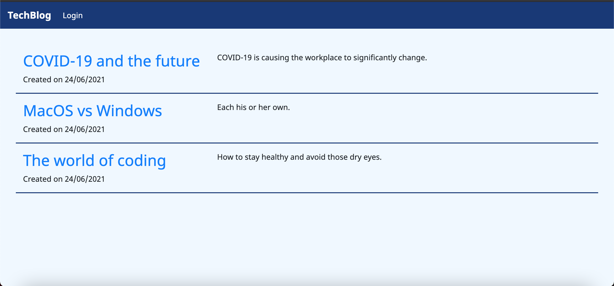
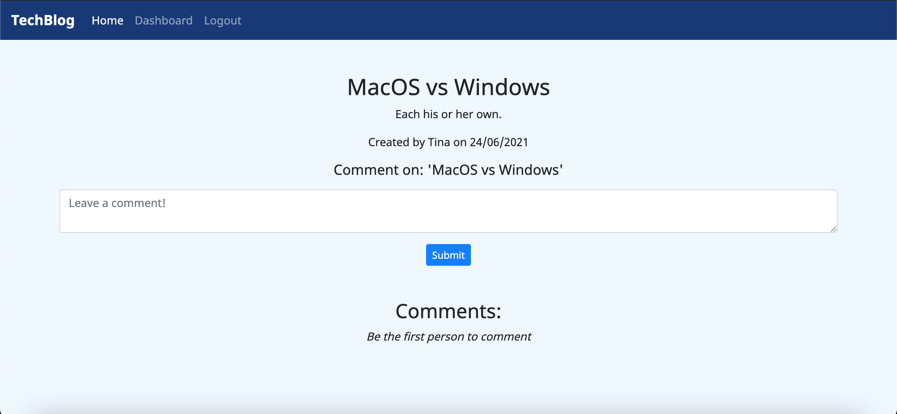
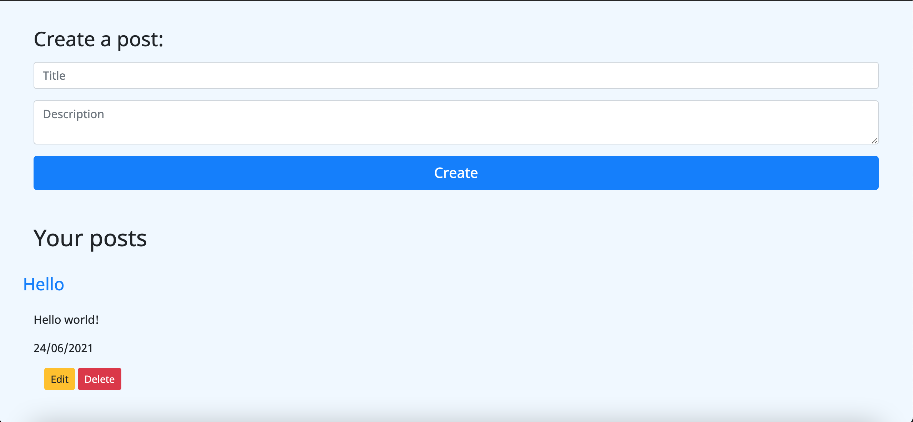

# TechBlog

  
  
  #### Table of Contents
  * [Project Description](#project-description)
  * [Installation Instructions](#installation-instructions)
  * [Test Instructions](#test-instructions)
  * [Screenshots](#screenshots)
  * [Usage Guidelines](#usage-guidelines)
  * [License](#license)
  * [Contribution Guidelines](#contribution-guidelines)
  * [Questions](#questions)

  ## Project Description 
  A technology blog where users can create new posts to add to a list of posts which can be seen on the main homepage by all. The post can be edited and also deleted by the user.
  Users can comment on other blog posts they enjoy.

  ## Installation Instructions
  * npm i

  ## Test Instructions
  * npm run seed
  * node server.js

  ## Screenshots
  ]
  ]
  ]

  ## Usage Guidelines
  * To see deployed app:
  (https://arcane-retreat-86441.herokuapp.com)

  ## Credits
  * sm3085

  ## Contribution Guidelines
  * All contributions welcome! 

  

  ## Questions
  If you have any questions about the repo, contact me directly at smj3085@hotmail.com.  
  You can find more of my work at [smj3085](http://github.com/smj3085).